# Analytics Agent (nao) 🤖📊

A privacy-focused, local-first analytics agent that lets you query your CSV data using natural language. It generates optimized SQL, executes it against a local SQLite database, and visualizes the results.

## 🌟 Features

- **Natural Language Querying**: Ask questions in plain English ("Show total revenue mostly by region").
- **Multi-Model Support**: Switch between **OpenAI**, **Google Gemini**, and **Groq** (Llama 3).
- **Local-First Architecture**: Your data stays local in a SQLite database; only the schema and question are sent to the LLM.
- **Smart Visualization**: Automatically picks the best chart type (Line, Bar, Table) for your data.
- **Interactive Chat UI**: A modern React-based interface with dark mode and glassmorphism design.

## 🏗️ Architecture

```mermaid
graph TD
    User[👤 User] -->|1. Asks Question| Frontend[💻 React Frontend]
    Frontend -->|2. POST /ask| Server[🚀 Express Server]

    subgraph "Backend Services"
        Server -->|3. Build Prompt| Schema[📄 Schema Reader]
        Server -->|4. Generate SQL| LLM[🧠 LLM Service]
        LLM -->|OpenAI / Gemini / Groq| API[☁️ External LLM API]
        API -->|SQL| LLM
        Server -->|5. Execute SQL| DB[(🗄️ SQLite DB)]
        DB -->|Results| Server
    end

    Server -->|6. JSON Response| Frontend
    Frontend -->|7. Render Chart| User
```



## 📂 Project Structure

- **`packages/cli`**: Command-line tool to initialize projects and load data.
- **`packages/server`**: Express backend handling API requests and database interactions.
- **`packages/web`**: React + Vite frontend for the chat interface.
- **`my-project/`**: Your active analytics project (schema + data).
- **`sample/`**: Sample CSV data to get you started.

## 🚀 Quick Start

### 1. Setup Environment

Create a `.env` file in the root directory:

```bash
cp .env.example .env
# Edit .env with your API keys (OPENAI_API_KEY, GEMINI_API_KEY, or GROQ_API_KEY)
```

### 2. Initialize a Project

Create a new analytics project folder (if you haven't already):

```bash
npx tsx packages/cli/src/index.ts init my-project
```

### 3. Load Your Data

Copy your CSV file into the `data/` folder and load it:

```bash
# Copy sample data
cp sample/sales.csv my-project/data/

# Load data into SQLite
cd my-project
# NOTE: Make sure to clear previous databases if reloading
rm -rf data/analytics.db
npx tsx ../packages/cli/src/index.ts load data/sales.csv
```

### 4. Run the Application

Open **two terminal tabs**:

**Terminal 1 (Backend):**

```bash
# Start backend on port 3000
PORT=3000 npx tsx packages/server/src/index.ts
```

**Terminal 2 (Frontend):**

```bash
cd packages/web
npx vite
```

### 5. Use the App

1. Open [http://localhost:5173](http://localhost:5173).
2. Enter your project path: `/absolute/path/to/nao/my-project`.
3. Start asking questions!

## 🔧 Configuration

You can configure the LLM provider in your `.env` file:

```bash
# Provider: openai, gemini, or groq
LLM_PROVIDER=groq

# Optional: Override Model
GROQ_MODEL=llama-3.3-70b-versatile
```
